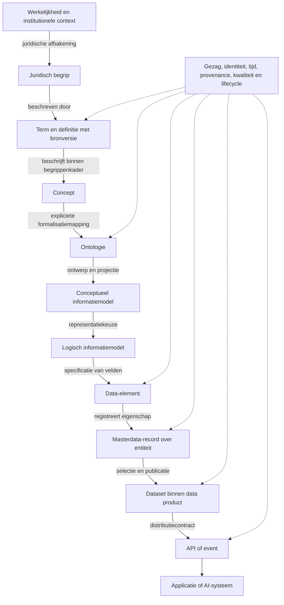

# Onderzoeksontwerp: Semantic Master Data Product voor de Nederlandse overheid

Onderzoeksbaseline: 7 september 2026. Status: brononderbouwde verkenning en voorstel voor Design Science Research (DSR), geen volledige paper, afgeronde systematische review of evaluatierapport.

## Leeswijzer en bewijsdiscipline

Dit dossier omvat [standards-matrix.csv](standards-matrix.csv), [literature-matrix.csv](literature-matrix.csv), [claims-register.csv](claims-register.csv) en [proposed-paper-outline.md](proposed-paper-outline.md). Bron-ID's S01–S50 en L01–L17 verwijzen naar de matrices, inclusief primaire URL, raadpleegdatum, relevante bronlocatie en bewijsniveau. C-Sxx en C-Lxx registreren bronfeiten; R01–R22 registreren eisen en hun operationalisatie; G01–G03 zijn expliciet ongetoetste hypothesen. Conceptuele definities en onderzoekskeuzes hieronder zijn een eigen synthese, tenzij anders aangegeven.

Het prototype is uitsluitend bestaand onderzoeksartefact. De aanwezigheid van functionaliteit, een gekozen technologie of een werkende demonstratie vormt geen bewijs voor een eis, architectuurkeuze of wetenschappelijke bijdrage. De requirements-baseline wordt eerst onafhankelijk beoordeeld en vastgezet. Pas daarna wordt het prototype een mogelijk evaluatieobject.

De inventarisatie heeft drie bewijsniveaus: primaire specificatietekst voor relevante passages; officieel abstract/catalogus voor beperkte scopeclaims; bibliografische verificatie zonder inhoudelijke conclusie. Vooral ISO, NEN en DAMA-DMBOK zijn niet volledig gelezen. Dit dossier claimt daarom geen clausuledekkende normanalyse of ISO-conformiteit. Inhoudelijke relaties en hiaten in de matrices zijn analytische beoordelingen ten opzichte van deze onderzoeksvraag, geen door alle standaardeigenaren onderschreven conclusies.

Een standaard is niet vanzelf wettelijk verplicht. Publicatiestatus, releaseversie, Nederlandse lijststatus, organisatorisch werkingsgebied en functioneel toepassingsgebied worden apart vastgesteld. Bij latere toepassing moet ook het concrete besluit, de aanschafcontext of deelnameovereenkomst worden betrokken. De inventarisatiedatum is geen garantie dat iedere webpagina op die datum bijgewerkt was.

## 1. Praktisch probleem

Voor hergebruik van basisgegevens moet een afnemer kunnen vaststellen waar een waarde over gaat, welke afbakening geldt, wie de bron beheert, welke toestand wordt beschreven en onder welke voorwaarden het gegeven bruikbaar is. Het probleem dat dit onderzoek adresseert is het ontbreken van een **aangetoonde, samenhangende en toetsbare verbinding** tussen die antwoorden binnen een afgebakende registratieketen. Dit is een onderzoeksprobleemstelling; de frequentie en maatschappelijke omvang van concrete fouten zijn nog niet empirisch vastgesteld.

De geraadpleegde kaders verdelen hun aandacht: MDM-literatuur behandelt organisatie en systeemfuncties; terminologie- en modelstandaarden beschrijven betekenis; catalogusprofielen beschrijven aanbod; interfaceprofielen beschrijven uitwisseling. Een functioneel MDQM-referentiemodel bestaat al en is dus een belangrijk antecedent, geen ontbrekende uitvinding. [Otto, Hüner en Österle, 2012](https://link.springer.com/article/10.1007/s10257-011-0178-0) (L05).

De primaire casus is het Stelsel van Basisregistraties. Als uitvoerbare eerste uitsnede wordt BAG voorgesteld: pand, verblijfsobject en nummeraanduiding, met één relatie naar een tweede registratie voor externe validatie. De definitieve tweede registratie wordt gekozen op beschikbare gezaghebbende documentatie en historie, niet op wat het prototype ondersteunt. De officiële [BAG-cataloguspublicatie](https://www.geobasisregistraties.nl/documenten/2018/03/12/catalogus-2018) en [Kadaster-begripsbeschrijving verblijfsobject](https://catalogus.kadaster.nl/bag/en/page/Verblijfsobject) bieden onafhankelijk casusmateriaal (S49).

Een illustratief probleem is een afnemer die het label ‘gebouw’ gebruikt waar de bron een specifieker object afbakent. Een gelijk label of vergelijkbare geometrie is onvoldoende om identiteiten gelijk te stellen. Dit is een te construeren testcase, geen gerapporteerd incident. Andere testgevallen zijn een definitiewijziging, een correctie met terugwerkende kracht en een kwaliteitsmelding die nog in onderzoek is.

## 2. Knowledge gap en relevantie

**Voorlopige wetenschappelijke knowledge gap (G01):** onvoldoende onderbouwde ontwerpkennis over hoe een federatief beheerd masterdataproduct de verbinding tussen juridische/terminologische betekenis, ontologische categorieën, modelspecificaties, records en productcontracten expliciet kan bewaren en evalueren, inclusief wijzigingen door de tijd.

Dit is geen claim dat er geen integraties bestaan. MIM en NL-SBB beschrijven reeds hun samenhang; DQV en DCAT combineren kwaliteits- en catalogusmetadata; PROV-O ondersteunt herkomst. De mogelijke bijdrage ligt in getypeerde verbindingsregels, randvoorwaarden, verliesanalyse en empirisch beoordeelde ontwerpprincipes. [NL-SBB, onderdelen 5.4–5.5](https://docs.geostandaarden.nl/nl-sbb/def-st-nl-sbb-20241010/) en [DQV](https://www.w3.org/TR/vocab-dqv/) zijn directe tegenargumenten tegen een te brede noveltyclaim (S14, S34).

De gap wordt weerlegd of ingeperkt wanneer eerder werk dezelfde integratieverplichtingen, contextvoorwaarden én vergelijkende evaluatie afdoende bevat. Een nieuwe naam voor bestaande Linked Data-componenten is onvoldoende bijdrage. De positionering is voorlopig een kandidaat voor exaptation of improvement; zij moet worden getoetst aan bestaande ontwerpkennis. [Gregor en Hevner, 2013](https://ailab-ua.github.io/courses/MIS611D/gregor-2013-positioning-presenting-design-science-research.pdf) (L04).

**Maatschappelijke relevantie:** de beoogde opbrengst is beter controleerbaar gegevenshergebruik en herstel van fouten, met minder interpretatieruimte voor afnemers. Daarmee sluit het onderzoek aan op de publieke doelen achter het stelsel. Werkelijke reductie van administratieve lasten, schade of kosten blijft buiten de aangetoonde resultaten van deze fase. [Kamerstuk 26387 nr.18](https://zoek.officielebekendmakingen.nl/kst-26387-18.html) (S25).

**Wetenschappelijke relevantie:** het onderzoek kan verklaren welke verbindingen nodig zijn, onder welke omstandigheden zij werken en welke complexiteit zij toevoegen. Daarbij worden dataproductdenken, MDM, ontology engineering en interoperabiliteit gekoppeld zonder ze als één discipline te behandelen. De dataproductliteratuur biedt een gebruiksgerichte benadering, maar onderbouwt niet automatisch een specifieke opslagarchitectuur. [Blohm et al., 2024](https://link.springer.com/article/10.1007/s12599-024-00876-5) (L12).

## 3. Drie alternatieve hoofdvragen

### A. Integratie en traceerbaarheid — aanbevolen onderzoeksrichting

**Hoe kan een Semantic Master Data Product voor het Stelsel van Basisregistraties worden ontworpen en geëvalueerd dat betekenis, gezag, identiteit en historie traceerbaar verbindt van begripsbron tot machinebruikbare gegevensverstrekking?**

1. Welke functionele, semantische en governance-eisen volgen uit toepasselijke literatuur, standaarden en stelselafspraken?
2. Welke soorten entiteiten, representaties en relaties moeten onderscheiden worden, en waar ontstaan betekenisconflicten?
3. Welke mappings en versie-/provenanceregels bewaren de traceerbaarheid tussen deze niveaus?
4. Welke ontwerpprincipes en contracten kunnen deze eisen realiseren, en welke alternatieven zijn eenvoudiger?
5. In welke mate verbetert het ontwerp interpretatie, historische reconstructie en wijzigingsanalyse tegenover passende baselines?
6. Welke resterende beperkingen ontstaan bij gebruik door een informatiesysteem en een AI-consument?

### B. Ontology-driven conceptual modelling

**Onder welke voorwaarden verbetert ontologisch gefundeerde conceptual modelling de semantische precisie en overdraagbaarheid van masterdata in een Semantic Master Data Product voor Nederlandse basisregistraties?**

1. Welke identiteits-, rol-, classificatie- en temporaliteitsproblemen bevat de onafhankelijk gekozen casus?
2. Welke verschillen bestaan tussen directe MIM-modellering en modellering met foundational ontology-analyse?
3. Hoe kunnen UFO/OntoUML-constructies naar MIM en een uitvoerbare representatie worden vertaald, en wat gaat daarbij verloren?
4. Welke fouten vinden onafhankelijke beoordelaars met iedere aanpak, bij vergelijkbare beschikbare informatie?
5. Wat is de verhouding tussen gevonden fouten, modelleertijd, uitlegbaarheid en onderhoudbaarheid?

OntoUML is hier een kandidaat-modelleertaal met ontologische grondslag, **geen Nederlandse overheidsstandaard**. Ook voordeel van UFO wordt niet vooraf aangenomen. L08–L10 en R22 vormen de onderbouwing en toetsrichting.

### C. Federatief beheer en verandering

**Hoe kunnen governance en machine-interpreteerbare productcontracten samen de betekenis en herleidbaarheid van federatieve masterdata behouden bij veranderingen in definities, modellen en gegevens?**

1. Wie heeft welke bevoegdheid over definitie, model, record, kwaliteitsregel en productrelease?
2. Welke veranderingen vragen een nieuwe identiteit, een nieuwe versie, een mapping of intrekking?
3. Welke contractmetadata en distributieafspraken zijn nodig voor afnemers om veranderingen te verwerken?
4. Hoe worden terugmeldingen, correcties en historische bewijsvoering over organisatiegrenzen afgehandeld?
5. In welke mate beperken de ontworpen afspraken interpretatiefouten, herstelduur en onbeheerde afhankelijkheden?

Kies voor één hoofdvraag; de drie vormen geen drie volledige onderzoeken binnen één paper. Richting A heeft de breedste aansluiting op de oorspronkelijke vraag. B wordt daarin een begrensde ablatietest; C levert governancevoorwaarden. Als de beschikbare evaluatiecapaciteit beperkt is, heeft B of C een beter af te bakenen empirische omvang.

## 4. Conceptueel woordenboek

Deze werkdefinities zijn onderzoeksconventies met genoemde aanknopingspunten, geen universele gelijkstellingen tussen standaarden. ‘Conceptueel object’ is geen extra synoniem voor begrip: hieronder duidt het een individueel domeinobject op conceptueel niveau aan. Een type van zulke objecten wordt expliciet als type gemodelleerd.

| Construct | Werkdefinitie | Cruciaal onderscheid | Aanknopingspunt |
|---|---|---|---|
| Term | Talige aanduiding van een begrip in taal en context | Een term kan meerdere betekenissen hebben | S11, S14 |
| Begrip / concept | Eenheid van betekenis binnen een afgebakend domein | Niet zijn label, document of fysieke instantie | S11, S31 |
| Definitie | Beschrijving die een begrip afbakent | Definitietekst is niet automatisch logische formalisatie | S11, S14 |
| Juridisch begrip | Begrip met betekenis binnen een rechtsbron en toepassingscontext | Juridische interpretatie niet reduceren tot een los label | S14, S25 |
| Conceptueel object | Individueel beschouwd object in het gemodelleerde domein, fysiek of sociaal/institutioneel | Object is niet de registratie ervan | L08 |
| Ontologische klasse | Formeel gedefinieerde categorie waarvan individuen instantie kunnen zijn | Representatieconstructie; ontologische categorie kan rijker zijn dan OWL | S30, S40 |
| MIM-objecttype | Modelconstructie die een type object beschrijft | Metamodelconstructie; niet automatisch dezelfde resource als domeinklasse | S13 |
| Attribuut | Eigenschap zoals beschouwd in een model | MIM-attribuutsoort, OWL-property en concrete attribuutwaarde verschillen | S13, S08 |
| Data-element | Geregistreerde eenheid van dataspecificatie met betekenis en representatie | Geen individuele veldwaarde; DEC en value domain onderscheiden | S08 |
| Identifier | Aanduiding bedoeld om iets binnen een scope te identificeren | Sleutelwaarde, entiteit-IRI, record-ID en versie-ID niet vermengen | S28, S38 |
| Masterdata-entiteit | Domeininstantie waarover herbruikbare kerngegevens worden beheerd | Geen ‘golden record’ en geen verplichte centrale kopie | Eigen synthese, L05 |
| Masterdata-record | Geregistreerde beschrijving van een masterdata-entiteit vanuit bron en tijdcontext | Meerdere records kunnen één entiteit beschrijven | Eigen synthese, L05, L14 |
| Dataset | Afgebakende verzameling data als catalogiseerbaar aanbod | Een RDF dataset is een technisch graph-construct; niet noodzakelijk hetzelfde | S47, S28 |
| Data service | Dienst die toegang tot of verwerking van data biedt | Dienst is niet de data en niet alleen een endpoint-URL | S47 |
| Data product | Beheerd aanbod voor een omschreven gebruikersbehoefte, met data, toegang en expliciete verantwoordelijkheid | Kan meerdere datasets en diensten omvatten | Werkdefinitie, L12 |

**Semantic Master Data Product (SMDP), werkdefinitie:** een beheerd data product waarin herbruikbare kerngegevens verbonden zijn met expliciete betekenis, brongezag, identiteit, historie, kwaliteit en gebruikscontracten. ‘Semantic’ vereist in dit onderzoek dat geselecteerde relaties en voorwaarden voor machines interpreteerbaar zijn; het vereist niet vooraf één database, één technologie of één ontologie.

Het product wordt niet als nieuw authentiek register gepositioneerd. Wie een bundeling maakt, krijgt daarmee niet de bevoegdheid de brondefinities of authentieke gegevens vast te stellen (R08). Masterdata wordt onderscheiden van transactiedata; referentiedata zoals een waardelijst kan meegeleverd worden maar is geen volledige vervanging van entiteitsrecords.

### Documentsoorten

| Soort | Gebruik in dit onderzoek | Voorbeeld |
|---|---|---|
| Standaard | Afspraken voor herhaald gebruik; formele status afzonderlijk benoemen | MIM, ADR |
| Norm | Als norm vastgestelde publicatie; verplichting afzonderlijk bepalen | ISO 704, NEN 3610 |
| Specificatie | Precieze beschrijving van structuur of gedrag | OpenAPI |
| Vocabulaire | Gedefinieerde termen/resources en relaties voor een toepassingsgebied | SKOS, DQV |
| Ontologie | Expliciete categorieën, relaties en semantische commitments | UFO, PROV-O |
| Metamodel | Beschrijft toegestane modelconstructies | MIM |
| Methodologie | Samenhangende wijze van onderzoek of analyse | DSRM, OntoClean |
| Architectuur | Inrichting en samenhang van onderdelen en verantwoordelijkheden | Nog te ontwerpen referentiearchitectuur |
| Governanceframework | Structuur voor besluitvorming, rollen en beheer | BOMOS |
| Best practice | Aanbevolen handelwijze; bewijs en reikwijdte variëren | Cool URIs |

Dit zijn verschillende classificatieassen: een ontologie kan in een standaarddocument gepubliceerd zijn. De verordening (EU) 2024/903 is wetgeving, FAIR een verzameling principes en DAMA-DMBOK een body of knowledge. Zij zijn niet allemaal technische standaarden (S01, S42, S46).

## 5. Semantische keten en theoretisch raamwerk

De gevraagde keten wordt gebruikt als **analysepad**, niet als verplichte lineaire ontstaansgeschiedenis. Juridische begrippen zijn zelf begrippen; termen en definities beschrijven ze. Wetgeving kan sociale objecten mede constitueren. Een object kan meerdere modellen en representaties hebben, en een wijziging kan terugwerken op eerdere schakels. Niet ieder begrip behoeft een OWL-klasse en niet iedere API een publiek SPARQL-endpoint (R01, R11, R14).

De pijlen zijn eigen kandidaat-relaties. Zij zijn geen bestaande standaardpredicaten. Waar het analysepad een niet-passende schakel bevat, moet een expliciete overslag of alternatieve mapping worden geregistreerd. Een ontologie kan bijvoorbeeld rechtstreeks als basis van een logisch model dienen; dat maakt een apart conceptueel model niet per definitie noodzakelijk.

| Overgang | Later vereiste bewijsverbinding | Mogelijk verlies of conflict |
|---|---|---|
| Werkelijkheid → juridische afbakening | Rechtsbron, geldingscontext, interpretatiebesluit | Niet alle werkelijkheid is juridisch relevant |
| Juridisch begrip → term/definitie | Versie van passage; beheerder; toepassingsperiode | Dezelfde term in verschillende wetten |
| Definitie → concept | Taal, begrippenkader, scope | Tekstwijziging versus betekeniswijziging |
| Concept → ontologie | Gemotiveerde formalisatiemapping | Definitie bevat uitzonderingen die niet formaliseerbaar zijn |
| Ontologie → conceptueel model | Constructmapping en ontologische aannames | Rollen of afhankelijkheden verdwijnen |
| Conceptueel → logisch model | Transformatieregel en cardinaliteitskeuze | N-aire relatie wordt onjuist versimpeld |
| Logisch model → data-element | DEC, domein, datatype, eenheid | Naam wordt ten onrechte als volledige betekenis gezien |
| Data-element → record | Bronwaarde, entiteit-ID, recordversie | Objectidentiteit en veldsleutel worden verwisseld |
| Record → dataset/product | Selectie, afleidingen, kwaliteit en publicatieversie | Gezagsclaim wordt onterecht geërfd |
| Product → API/event | Schema/context, semantische versie, contract | Bij bericht blijft alleen payload over |
| API/event → consument | Gebruikte versie, tijdcontext en bewijspad | AI kiest aannemelijke maar niet ondersteunde betekenis |

Deze mappingverplichtingen operationaliseren R01–R17. Een mappingrecord bevat minimaal bron- en doelartefact met versies, relatietype, richting, context, eventuele transformatie, verlies, rationale, reviewer en lifecycle-status. Voor niet-equivalente representaties is verliesregistratie belangrijker dan een onterechte ‘exacte’ mapping.

### Theoretische componenten

Het raamwerk verbindt vijf onafhankelijke perspectieven: terminologisch onderscheid (S11, S14); ontologische precisie (L08–L10); dataspecificatie en MDM (S08, L05); kwaliteit en governance (S12, L07); bruikbaarheid en interoperabiliteit (L12, S43, S46). Geen van deze perspectieven vervangt de andere.

De te onderzoeken mechanismen zijn **expliciete typering**, **traceerbare transformatie**, **tijd- en versiecontext** en **bevoegd beheer**. Uitkomstconstructen zijn interpretatiefouten, verliesloze reconstructie waar mogelijk, volledigheid van wijzigingsimpact en inspanning van afnemers. Contextvariabelen zijn juridische heterogeniteit, veranderfrequentie, aantal bronhouders, modelcomplexiteit en deskundigheid van de consument. G02 en G03 formuleren verwachte effecten; de pijlen tussen mechanisme en effect zijn nog geen gevalideerde theorie.

## 6. Aanvulling, overlap, conflicten en hiaten

| Combinatie | Verhouding en integratievraag | Consequentie |
|---|---|---|
| DAMA-DMBOK / ISO 8000 | Disciplines tegenover uitwisseling van characteristic master data | Geen organisatiearchitectuur uit een berichtnorm afleiden; S01–S06 |
| ISO 704 / NL-SBB / SKOS | Terminologiewerk, Nederlandse beschrijving en kennisrepresentatie | Term, definitie en concept apart; S11, S14, S31 |
| NL-SBB / MIM / ISO 11179 | Begrippen, modelconstructies en geregistreerde dataspecificaties | Niet één op één; leg DEC/value-domain-koppeling vast; S08, S13–S14 |
| UFO / OntoUML / MIM | Ontologische grondslag, taal en overheidsmetamodel | Analyse kan aanvullen; compatibiliteit is te bewijzen; S13, S40–S41 |
| RDFS / OWL / SHACL | Inferentie, axioma's en validatie | Sluitings- en entailmentaannames expliciet; S29–S32 |
| SKOS-mapping / OWL-equivalentie | Betekenisrelaties zijn niet dezelfde logische operatoren | Geen mechanische vervanging van exactMatch of broader; S30–S31 |
| ISO 8000-120 / PROV-O | Provenance-eisen tegenover representatievocabulaire | Mapping met cardinaliteiten en betekenis toetsen; S04, S33 |
| ISO 25012 / NORA / DQV | Kwaliteitsmodel, overheidstaal en metingen | Een metriek heeft context en meetmethode nodig; S12, S34, S48 |
| DCAT / DCAT-AP / DCAT-AP-NL | Basisvocabulaire en twee profileringsniveaus | Compatibiliteit per release en eigenschap toetsen; S16, S45, S47 |
| DCAT / data product | Catalogusaanbod tegenover beheerd gebruikersaanbod | Eigen productvelden onderbouwen, niet aan DCAT toeschrijven; L12, R13 |
| TOOI / MDTO | Overheidssemantiek tegenover duurzame toegankelijkheid | Overlap rechtvaardigt geen volledige gelijkstelling; S15, S24 |
| ADR / OpenAPI / Digikoppeling / FSC | Ontwerpregels, beschrijving en veilige connectiviteit | Interface- en transportconformiteit apart; S18–S21 |
| CloudEvents / OWL-Time / historie | Berichtcontext, tijdsrelaties en opgeslagen kennis | Een gebeurtenis is niet zijn notificatie; R06, R15 |
| EIF / IEA / FDS | Aanbevelingen, EU-wetgeving en deelnameafspraken | Binding hangt af van toepasselijkheid; R18, R21 |

**Werkelijk geconstateerde dekkingsgrenzen:** ISO 8000-110 sluit onder meer intern MDM-beheer uit; ISO 8000-120 specificeert geen volledig uitwisselformaat; ISO 8000-130/140 bepalen geen universele kwaliteitsdrempels. De officiële abstracts ondersteunen die grenzen, geen volledige technische conformiteitscheck (S03–S06). DQV is een Working Group Note, geen W3C Recommendation (S34).

**Onderzoeksafhankelijke hiaten:** een productcontract over alle semantische niveaus; afhandeling van strijdige brondefinities; identiteit bij splitsing/samenvoeging; herstel na gewijzigde betekenis; bewijs voor juiste AI-interpretatie. Dit zijn integratievragen R03, R10–R17 en G01–G03, geen claims dat iedere afzonderlijke standaard tekortschiet in haar eigen doel.

**Actuele statusverschillen die de analyse beïnvloeden:** MIM 1.2 staat als aanbevolen vermeld, NL-SBB 1.0 en SKOS op ‘pas toe of leg uit’. TOOI, MDTO en DCAT-AP-NL staan op de geraadpleegde Forum-pagina's in behandeling. De ontologieversie van TOOI is niet de documentatieversie op de lijst. ADR staat daar op 2.2; CloudEvents op 1.1. Zie de status-URL's bij S13–S24; een verouderde introductiepagina is niet leidend boven een gecontroleerde release.

Bij OWL-Time verwijst de algemene latest-URL naar een Candidate Recommendation Draft; de baseline gebruikt expliciet de [Recommendation van 19 oktober 2017](https://www.w3.org/TR/2017/REC-owl-time-20171019/). De matrix claimt niet dat iedere gekozen W3C-baseline de nieuwste ontwikkeling is. OpenAPI 3.1.1 is een technische onderzoeksreferentie; de Nederlandse lijst noemt 3.0. Dat verschil wordt vóór implementatie opgelost, niet stilzwijgend genegeerd (S19).

### Aanvullende bronnen alleen met aantoonbare reden

DCAT zelf (S47) is nodig om dataset, distributie en dienst onder de applicatieprofielen te onderscheiden. RFC 3986/3987 en Cool URIs (S38–S39) beantwoorden de expliciete identificatievraag. NORA-kwaliteit (S48) is opgenomen omdat FDS ernaar verwijst. De BAG-catalogus (S49) is casusspecificatie. OntoClean (S50) biedt een inhoudelijke vergelijking voor ontologische analyse. De aanvullende delen van ISO 8000 en 11179 zijn gekozen vanwege provenance, kwaliteit, registratie en data-elementen.

Geen automatische toevoeging van een volledige dataspace-stack, blockchain, vector database, nieuwe eventbroker of productcontractstandaard. ISO 19115/GeoDCAT-AP, ODRL en een formele rechtentaal worden pas detailonderwerp als respectievelijk geo-metadataconversie of machine-evalueerbaar rechtenbeleid onderdeel wordt van de casus. AVG, archiefrecht en toepasselijke AI-regels blijven randvoorwaarden; dit dossier verricht geen volledige juridische complianceanalyse.

## 7. Stelselvereisten en juridische afbakening

De twaalf eisen worden als historische beleidsbaseline gebruikt. De onderstaande nummering volgt de gebruikelijke stelselopsomming; de primaire brief groepeert de eerste vier als 1.1–1.4 onder heldere wetgeving. De concrete uitwerking wordt later met de geldende registratiewet getoetst (S25, R21).

| Eis | Verkorte inhoud | Latere ontwerpvertaling |
|---|---|---|
| 1 | Wettelijke regeling | Grondslag vastleggen |
| 2 | Terugmeldplicht | Correctieproces |
| 3 | Verplicht gebruik | Gebruikscontext |
| 4 | Duidelijke aansprakelijkheid | Verantwoordelijkheidsmodel |
| 5 | Redelijke kosten en duidelijke verdeling | Productgovernance |
| 6 | Duidelijke inhoud en bereik | Scope en definities |
| 7 | Sluitende afspraken/procedures | Lifecycle |
| 8 | Duidelijke toegankelijkheid | Toegangscontract |
| 9 | Stringente kwaliteitsborging | Meet- en herstelcyclus |
| 10 | Betrokkenheid afnemers | Review en feedback |
| 11 | Positie en relaties in stelsel | Koppelmetadata |
| 12 | Verantwoordelijk bestuursorgaan | Bevoegd gezag |

De architectuur kan financiële en bestuurlijke afspraken registreren of ondersteunen; zij realiseert daarmee niet zelfstandig eisen 1, 4, 5, 10 of 12. Authenticiteit is niet hetzelfde als absolute foutloosheid. Een product dat gegevens combineert moet brongezag per gegeven expliciteren en afgeleide interpretaties herkenbaar houden (R08, R19).

De [baseline kwaliteitszorg](https://www.digitaleoverheid.nl/wp-content/uploads/sites/8/2021/07/Baseline-kwaliteitszorg-stelsel-van-basisregistraties2.pdf) onderscheidt bronhouderonderzoek, terugmelding, transparantie over normen en meetmethoden, en interne/externe kwaliteitstoetsing. De rubriek met potentiële stelselafspraken mag niet als reeds vastgesteld worden gelezen (S26). Organisatorische barrières komen ook in empirisch MDM-onderzoek naar voren, maar die bedrijfsbevindingen moeten voor overheidsgebruik opnieuw worden getoetst (L17).

Voor FDS biedt [Afwegingskader v1](https://federatief.datastelsel.nl/afspraken/afwegingskader/v1/) concrete toetslabels: RE voor gezag en grondslag, MO voor sleutels, DA voor toegang, ME voor metadata en KW voor kwaliteit, terugmelding en diensten. KW001 is aanbevolen; andere regels hebben eigen binding. R18 vereist daarom beoordeling per regel. Een gestandaardiseerde sleutelwaarde maakt publicatie daarvan niet vanzelf toegestaan.

De [Interoperable Europe Act](https://eur-lex.europa.eu/eli/reg/2024/903) vraagt een toepasselijkheidsanalyse: artikel 1 bakent de diensten af, artikel 3 betreft besluiten over nieuwe of wezenlijk gewijzigde bindende eisen. Dit is geen algemene verplichting om ieder dataproduct met RDF, OWL of UFO te bouwen (S42).

## 8. Eisen die later tegen het prototype worden getest

Alle eisen staan met bron-ID's, binding en test-ID in het claims-register. Een ‘afgeleide ontwerpeis’ is een beredeneerde operationalisatie voor dit onderzoek; geen verzonnen MUST-clausule uit de aangehaalde standaard. Numerieke acceptatiedrempels hieronder zijn onderzoeksvoorstellen.

| Onderwerp | Eisen | Test en vereiste uitkomst |
|---|---|---|
| Terminologie en semantische keten | R01–R02 | T01–T02: onderscheid typen; volledig traceerpad of expliciete ontbrekende schakel |
| Identiteit en persistentie | R03 | T03: naamwijziging behoudt identiteit; splitsing/merge veroorzaakt geen stil hergebruik |
| Modellen en data-elementen | R04–R05 | T04–T05: reconstrueer veldbetekenis, representatie en decoderingsbron |
| Temporaliteit en historie | R06 | T06: correcte reconstructie van geldigheid én geregistreerde kennis |
| Provenance | R07 | T07: reproduceer afleiding met bron- en modelversies |
| Authenticiteit en gezag | R08 | T08: afzender, uitgever en bevoegd gezag aantoonbaar onderscheiden |
| Kwaliteit | R09 | T09: meetmethode, populatie, norm en resultaat afzonderlijk inspecteerbaar |
| Versiebeheer | R10 | T10: impact op afhankelijkheden; compatibele releasecombinatie |
| Semantische mappings | R11 | T11: richting, reikwijdte en verlies; geen onterechte equivalentie |
| Lifecycle | R12 | T12: review, publicatie, deprecatie en intrekking traceerbaar |
| Data-productmetadata | R13 | T13: gebruiker vindt doel, verantwoordelijke, data en contract |
| Distributie | R14 | T14: profielconformiteit én behoud van gekozen semantiek |
| Events en wijzigingen | R15 | T15: duplicates, volgordeproblemen en herstel volgens expliciet contract |
| Machine-interpreteerbare constraints | R16 | T16: inferentie en validatie afzonderlijk; externe waarheid niet gesimuleerd |
| Applicatie en AI | R17 | T17: juiste bronversie en verantwoord omgaan met ontbrekend bewijs |
| Stelselgovernance | R18–R19, R21 | T18–T19/T21: toepasselijke afspraken en terugmelding aantoonbaar ondersteund |
| Duurzame toegankelijkheid | R20 | T20: bewaarde bewijscontext interpreteerbaar na wijziging |
| Ontologische analyse | R22 | T22: foutdetectie en inspanning vergelijken, geen voorkeur vooraf |

Een benodigde productmetadata-uitbreiding wordt beperkt tot velden met concrete afnemersvraag: productidentiteit, doel/doelgroep, accountable eigenaar, bronhouders, juridische context, dataset-/dienstrelaties, semantische artefactversies, kwaliteit en meetmoment, servicebelofte, gebruikscondities, afhankelijkheden, release/lifecycle en wijzigingskanaal. Bestaande DCAT-eigenschappen worden waar passend hergebruikt; niet-gedekte velden krijgen expliciete eigen definities. Dit is R13, geen bestaand integraal normschema.

## 9. DSR-aanpak en artefact

Het artefact is een **technologieonafhankelijk referentiemodel plus toetsbaar integratieprofiel** voor een SMDP, met:

1. een getypeerd conceptueel model van betekenis, dataspecificatie, records en producten;
2. mapping- en transformatieregels met verliesanalyse;
3. een profiel voor identiteit, tijd, provenance, kwaliteit en versieafhankelijkheden;
4. een governance- en lifecyclemodel met verantwoordelijke rollen;
5. een conformiteits- en evaluatiesuite met positieve en negatieve casussen;
6. later een demonstrator die één implementatie van het profiel toont.

Deze fase levert het onderzoeksontwerp en de eisenbasis; het uitgewerkte integratieprofiel, de demonstrator en evaluatieresultaten zijn vervolgwerk. Een bestaand prototype kan later als instantiatie worden aangepast of verworpen. De wetenschappelijke bijdrage moet in de overdraagbare ontwerpkennis zitten, niet alleen in code (L01, L04).

| DSRM-stap | Activiteit | Controleerbaar resultaat |
|---|---|---|
| Probleem en motivatie | Bronnenstudie; later interviews met bronhouder, modelleur en afnemer | Probleemdossier met concrete, niet-verzonnen gevallen |
| Doelen bepalen | Eisen afleiden, scope toetsen, baseline vastzetten | R-register met binding en prioriteit |
| Ontwerp/ontwikkeling | Minimaal twee alternatieven; expliciete ontwerpbesluiten | Referentiemodel, mappings, rationale |
| Demonstratie | Onafhankelijk gekozen gegevens en wijzigingsscenario's | Reproduceerbare ketenvoorbeelden |
| Evaluatie | Formele checks, expertbeoordeling en vergelijkende taken | Bevindingen inclusief negatieve uitkomsten |
| Communicatie | Paper en auditbaar onderzoeksdossier | Traceerbare bijdrage en beperkingen |

Deze fasering volgt [Peffers et al.](https://www.jmis-web.org/articles/765) (L02). Het evaluatieontwerp onderscheidt kunstmatige en praktijkgerichte episodes, en formatieve en summatieve doelen, naar [FEDS](https://link.springer.com/article/10.1057/ejis.2014.36) (L03).

### Literatuur- en standaardenprotocol

Uitgevoerd: gerichte webzoekacties op officiële domeinen, primaire specificaties, uitgevers en institutionele repositories; selectie langs de door de gebruiker gevraagde kennisgebieden; gerichte inspectie van scopes, definities en releasegegevens. Dit is een onderbouwde seed set. Er zijn geen verzonnen aantallen gescreende publicaties, database-exporten of PRISMA-stappen.

Geraadpleegde zoekfamilies omvatten `master data quality management reference model`, `data governance conceptual framework structured review`, `data products data mesh data fabric`, `ontological foundations structural conceptual models`, `UFO OntoUML`, `Design Science Research Methodology`, en standaardnaam plus officiële organisatie. Ook is gezocht op de exacte voorlopige productnaam en de combinatie master data/MIM/NL-SBB. Een zwakke opbrengst van zulke smalle zoektermen bewijst geen knowledge gap.

Het vervolgprotocol voor een systematische review:

- Zoek in Scopus/Web of Science of een gedocumenteerd toegankelijk alternatief, AIS eLibrary, ACM DL, IEEE Xplore en Springer; NL en EN; geen vroege jaargensluiting voor funderende literatuur; einddatum expliciet vastleggen.
- Zoekblokken: `(master data OR reference data) AND (semantic* OR ontolog* OR metadata)`; `("data product*" OR "data mesh") AND (governance OR provenance OR semantic*)`; `(base registr* OR public sector OR e-government) AND (semantic interoperability OR conceptual model*)`; aanvullende blokken voor identiteit, temporaliteit, mapping en ontology evaluation.
- Inclusie: directe bijdrage aan een construct, eis, mechanisme of evaluatiemethode; wetenschappelijke bron met verifieerbare metadata, of primaire norm/overheidsafspraak. Standards- en empirische evidence apart coderen.
- Exclusie: marketing als bewijs van werking, oncontroleerbare bron, uitsluitend naamsovereenkomst, duplicaten, ongedateerde afgeleide standaardkopieën waar primaire bron bestaat. Abstract-only mag in de matrix, maar ondersteunt alleen de zichtbare claims.
- Registreer per database exacte query, datum, filters, export-ID, deduplicatie en uitsluitreden. Doe backward/forward snowballing op L05, L08–L13 en directe concurrerende integratieprofielen.
- Laat een tweede menselijke onderzoeker een steekproef en alle claims over verplichtingen/novelty onafhankelijk coderen. Dit is een voorgestelde onderzoeksmaatregel, nog niet uitgevoerd.
- Beoordeel vraag-methodefit, helderheid evaluatie, beschikbare data, externe geldigheid en mogelijke belangen. Zoek actief tegenbewijs voor G01–G03.

Een verzadigingscriterium is niet alleen ‘geen nieuwe papers’: alle R-eisen hebben voldoende bewijs voor de gebruikte claimsterkte, conflicterende definities zijn geregistreerd, en concurrerende ontwerpen zijn expliciet vergeleken. Zonder dat resultaat blijft de gap voorlopig.

## 10. Mogelijke design principles

Deze principes zijn hypothesen in vorm context → interventie → verwacht effect. Ze volgen uit het requirements-register en worden niet gepresenteerd als reeds bewezen best practices.

| Principe | Context, ontwerpactie en verwacht effect | Eis / falsificatie |
|---|---|---|
| DP1 Getypeerde betekenisverbindingen | Bij meerdere representaties: behoud afzonderlijke typen en expliciete mappings, zodat verwisselingen detecteerbaar worden | R01/R04/R11; geen foutreductie of veel extra ambiguïteit |
| DP2 Gezag op de juiste schaal | Bij samengestelde data: leg bevoegdheid per bron/gegeven vast, zodat bundeling geen ongefundeerd gezag suggereert | R02/R08; experts kunnen gezag nog niet bepalen |
| DP3 Identiteit onafhankelijk van presentatie | Bij wijzigingen: scheid identiteit, naam en versie, zodat verwijzingen geldig blijven | R03/R10; splitsingen leiden toch tot foutieve identity merges |
| DP4 Historische reproduceerbaarheid | Bij correcties: leg meerdere tijdrollen en afhankelijkheden vast, zodat eerdere kennis herleidbaar blijft | R06/R07; historische antwoorden niet reproduceerbaar |
| DP5 Gelaagde kwaliteitscontrole | Bij heterogene regels: combineer logische analyse, datavalidatie en broncontrole, zodat resultaten niet als totale waarheid worden gelezen | R09/R16; false confidence of onaanvaardbare foutlast |
| DP6 Expliciet productcontract | Bij hergebruik: verbind gebruikersdoel, data, diensten en beheer, zodat afnemers juiste keuzes maken | R13/R14; geen betere taakprestatie |
| DP7 Beheersbare betekenisverandering | Bij federatief beheer: behandel semantische wijzigingen als reviewed releases met impactanalyse | R10/R12/R15/R19; herstelduur of onderhoudslast onaanvaardbaar |
| DP8 Ontologische diepgang naar behoefte | Bij identiteit/rolproblemen: toets foundational analyse en gebruik haar alleen bij aantoonbare meerwaarde | R22; analyse kost meer zonder inhoudelijke winst |

## 11. Evaluatiecriteria en onderzoeksopzet

### Onafhankelijke casus en baselines

Stel vóór prototype-inspectie een expertgevalideerde gold set vast met begrippen, bronpassages, recordversies, mappings en competency questions. Begin met BAG; voeg voor overdraagbaarheid een afzonderlijke registratiecontext toe. Gebruik openbare of synthetische records zonder persoonsinformatie. Synthetische veranderingen worden als zodanig gelabeld; zij zijn geen historische gebeurtenissen.

Voorgestelde pilotomvang: 30–50 vragen verdeeld over 6 scenariofamilies en 20–30 wijzigings-/validatiegevallen. Dit is een haalbaarheidsvoorstel, geen statistisch onderbouwde steekproefgrootte. Bepaal na de pilot welke omvang voor de primaire uitkomst nodig is. Houd testgevallen buiten de ontwerpset.

Vergelijk:

- B0: dezelfde data, reguliere catalogus en API-documentatie;
- B1: dezelfde broninformatie met expliciete semantische mappings, zonder de volledige cross-layer provenance- en versieverbinding;
- B2: het volledige ontworpen integratieprofiel;
- ablaties: B2 zonder ontologische analyse, zonder temporele provenance of zonder productcontractuitbreidingen.

Alle condities krijgen dezelfde inhoudelijke bronnen en vergelijkbare ontsluitingskwaliteit. Anders meet men meer documentatie in plaats van de ontworpen structuur. Een relationeel register met expliciete mappings blijft een serieuze technische kandidaat naast een RDF-graaf of federatieve publicatieopzet. RDF, OntoUML en microservices zijn geen vooraf vastgestelde architectuuruitkomst.

### Competency questions

1. Welke definitie en rechts-/beleidsbron horen bij dit veld in release X?
2. Welk werkelijk of institutioneel object beschrijft het record, en hoe wordt dat van zijn beschrijving onderscheiden?
3. Welke waarde gold op datum t, volgens de kennis geregistreerd op datum k?
4. Welke afnemers en constraints worden geraakt door een gewijzigde definitie of mapping?
5. Is een gevonden equivalentie ontologisch, terminologisch of uitsluitend een representatietransformatie?
6. Welke bronhouder en bewijsstukken ondersteunen een betwist gegeven?
7. Welke actuele kwaliteitsmeting geldt voor deze selectie en niet alleen voor de gehele dataset?
8. Kan de consument vaststellen dat onvoldoende bewijs bestaat voor een antwoord?

### Metingen

| Criterium | Operationalisatie | Voorgestelde beoordeling |
|---|---|---|
| Semantische juistheid | Correcte antwoorden/mappings tegenover onafhankelijke gold set | Primair: foutenpercentage en foutzwaarte; kritieke identity/authority-fouten nul in conformiteitsset |
| Traceerbaarheid | Aandeel vereiste schakels aanwezig én juist, niet alleen links tellen | 100% voor verplichte schakels van afgebakende tests, of expliciete niet-dekking |
| Historie | Antwoord op t/k-vraag; bron- en modelversies reproduceerbaar | Alle kritieke correctiegevallen correct |
| Constraints | Precision/recall op geïnjecteerde fouten; false positives | Per foutsoort rapporteren; geen betekenisloze gemiddelde ‘kwaliteitsscore’ |
| Mappingkwaliteit | Juiste richting, equivalentie en verliesannotatie | Expertbeoordeling; disagreements apart |
| Wijzigingsanalyse | Precision/recall van geraakte afhankelijkheden; herstelduur | Vergelijk B0/B1/B2 en verklaar trade-offs |
| Interoperabiliteit | Dezelfde interpretatie in twee onafhankelijke consumentimplementaties | Payloadvaliditeit én resultaatvergelijking |
| Governance | Herleidbaar besluit en accountable rol per testwijziging | Scenario-review; geconfigureerde rol is niet bewijs van feitelijk gezag |
| Gebruikersinspanning | Taaktijd, benodigde stappen, fouten en kwalitatieve feedback | Gepaarde taken met gerandomiseerde volgorde |
| Kosten en schaal | Modelleer-/onderhoudsuren; opslaggroei; querylatentie | Meet werkbelasting en percentielen; eisen vooraf met gebruikers afspreken |
| AI-gebruik | Ondersteunde antwoorden, correcte citaties/versies, onthouding | Gescheiden van gewone API-consument; geen algemene ‘AI-ready’-score |

Voor de AI-proef worden modelversie, prompt, retrieval, toegang, parameters en datasetrelease vastgezet. Vergelijk condities op dezelfde vragen; herhaal bij stochastische uitvoer. Beoordeel cited-but-wrong antwoorden afzonderlijk van ontbrekende citaties. RAG motiveert een mogelijke consumentarchitectuur, maar levert geen bewijs dat dit SMDP hallucinatiereductie oplevert. [Lewis et al., 2020](https://proceedings.neurips.cc/paper_files/paper/2020/hash/6b493230205f780e1bc26945df7481e5-Abstract.html) (L16, G02).

Rapporteer effectgroottes en onzekerheidsintervallen waar steekproef en onafhankelijkheid dat toelaten; behandel herhaalde antwoorden op één vraag niet als onafhankelijke proefpersonen. Zonder voldoende cases blijft de analyse beschrijvend. Laat bij voorkeur twee beoordelaars blind en onafhankelijk scoren met adjudicatie. Het primaire resultaat is semantische correctheid; een snellere query compenseert geen onjuiste identity merge.

## 12. Threats to validity

| Bedreiging | Waarom relevant | Mitigatie en resterende beperking |
|---|---|---|
| Prototype- en bevestigingsbias | Eisen kunnen achteraf bestaande keuzes legitimeren | Baseline vóór inspectie; onafhankelijke gold set; alternatieven verplicht vergelijken |
| Constructvaliditeit | ‘Semantisch’, ‘gezaghebbend’ en ‘AI-ready’ zijn breed | Operationaliseer per R-eis; geen samengestelde score zonder weging |
| Selectiebias literatuur | Webzoekactie en Nederlandse voorkeursbronnen | Systematische zoekfase en snowballing; huidige seed set niet uitputtend |
| Toegangsbias | ISO/DMBOK en artikelen deels achter toegang | Abstractclaims beperken; volledige passages verkrijgen vóór conformiteitsclaim |
| Interne validiteit | B2 heeft meer informatie of betere interface | Gelijke bronnen; ablaties; vergelijkbare implementatiekwaliteit |
| Onderzoekersinvloed | Ontwerper bepaalt ook juist antwoord | Onafhankelijke beoordeling; vastgelegde conflicten en adversariële cases |
| Externe validiteit | BAG is sterk georiënteerd op locatie en publiek aanbod | Tweede domein; geen generalisatie naar BRP zonder extra onderzoek |
| Temporele validiteit | Wetgeving, modellen en standaardstatus veranderen | Exacte versies en raadpleegdatum; release-freeze en hercontrole |
| Ecologische validiteit | Synthetische fouten missen praktijkcomplexiteit | Later gebruikerstaken en echte toegestane correcties; onderscheid test/veldresultaat |
| Statistische conclusie | Kleine steekproef, veel criteria en afhankelijke AI-runs | Primair criterium vooraf; cluster per vraag; onzekerheid rapporteren |
| Ontologische commitment | UFO kan een interpretatie bevoordelen | Alternatieve modellering; expliciete verliezen; geen noodzakelijkheid claimen |
| Provenancevertrouwen | Correcte graaf kan onware bronclaims bevatten | Verificatie bron en bevoegdheid buiten graaf; bewijsstatus vastleggen |
| Versieverwarring | Familie-, profiel-, schema- en documentversies verschillen | Afzonderlijke versieassen; releasekruistabel vóór implementatie |

## 13. Scope en non-scope

**In scope:** eisenafleiding; constructafbakening; semantische keten; identiteit, tijd, provenance, gezag, kwaliteit, mappings en lifecycle; productmetadata; contracten voor distributie en wijziging; DSR-artefactontwerp en evaluatieprotocol. De toepassing is federatief publiek masterdatabeheer, met één uitvoerbare casusuitsnede en één tweede context voor overdraagbaarheid.

**Expliciete non-scope:** nu een volledige paper schrijven; inhoudelijk beoordelen of certificeren van het bestaande prototype; productie-invoering; alle registraties integraal modelleren; vervangen van wettelijke bronhouders; universele overheidsontologie; volledige ISO-conformiteitsverklaring; volledige privacy/security/archief-/AI-wetgevingsaudit; persoonsidentificerende datasets verwerken; autonoom juridisch beslissen; foundation-modeltraining; grootschalig performancebenchmarkonderzoek zonder aantoonbare onderzoeksvraag.

Gegevensuitwisseling en authenticiteit vereisen juridische context, maar dit ontwerp levert geen juridisch oordeel over een concrete verwerking. Ontologische analyse is in scope als toetsbare methode; organisatiebrede verplichte invoering van OntoUML niet.

## 14. Open bewijswerk en vervolgvolgorde

1. Volledige, rechtmatig beschikbare ISO 8000-, ISO 11179-, ISO 704-, ISO 25012-, NEN 3610- en DMBOK-passages verkrijgen en per eis afbakenen. Geen clausulenummers invullen op basis van geheugen.
2. Bibliografisch geverifieerde maar inhoudelijk open bronnen, met name L06, volledig extraheren; recente directe integratie- en mappingliteratuur systematisch onderzoeken.
3. SEMIC-referentiereleases in S44 bij de definitieve casuskeuze op geschiktheid en opvolgers controleren; er bestaat geen enkel familieversienummer. Het profiel met passend toepassingsgebied voor OpenAPI/ADR en DCAT-AP-NL/DCAT-AP controleren.
4. Huidige registratiewet, regeling, catalogus en historie van de definitieve casus vastzetten. De bronpagina voor BAG is nu voldoende voor casusselectie, niet voor alle juridische testantwoorden.
5. Requirements laten reviewen, bewijsstatus bijwerken en baseline voorzien van versie en hash. Dan pas prototype-inventarisatie en ontwerpvergelijking inhoudelijk starten.
6. Artefact uitwerken, demonstreren en evalueren. Negatieve bevindingen en niet-gedekte eisen publiceren naast successen.

Deze open punten beperken de sterkte van conclusies, maar verhinderen niet het huidige onderzoeksontwerp. De vijf gevraagde bestanden vormen een reviewbaar startdossier; zij zijn geen vervanging van de nog uit te voeren empirische fase.

## 15. Beperkte inventarisatie bestaand prototype

Bij aanvang was `/mnt/development/Codex/Paper` leeg (O01). In deze werkmap is daarom geen prototype geïnventariseerd. Het bestaan van een technisch prototype is bekend uit de opdracht, maar naam, commit, modules, technologieën en bewijsstukken zijn hier niet vastgesteld. Andere projecten zijn niet als impliciet prototype aangenomen.

Bij latere inventarisatie wordt uitsluitend eerst geregistreerd: locatie, versie/commit, beschikbare documentatie, componentnamen, interfaces, gebruikte standaarden zoals door het project geclaimd, en beschikbare testartefacten. Zulke claims blijven projectclaims. Daarna kunnen T01–T22 onafhankelijk worden uitgevoerd met uitkomsten ‘voldoet’, ‘voldoet niet’, ‘niet van toepassing’ of ‘onvoldoende bewijs’. Geen van deze uitkomsten is in deze fase al toegekend.
